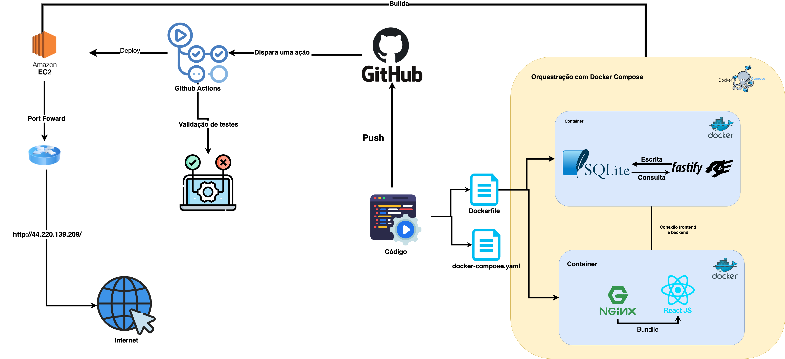
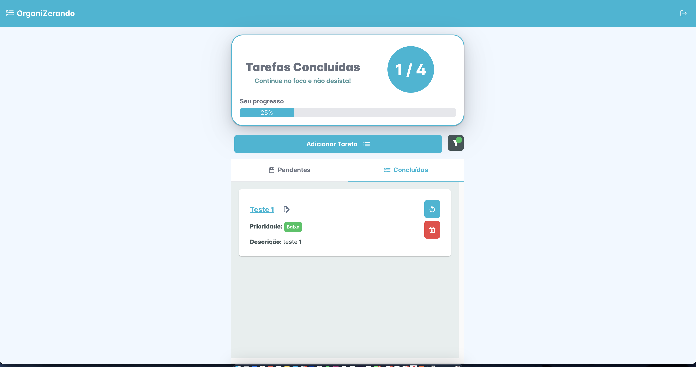

# desafio-IAM-Grupo-Boticario

## OBS: Aplicação presente no link: [http://44.220.139.209/](http://44.220.139.209/)

## 1. Introdução

Este projeto, denominado **Organizerando**, foi desenvolvido como um Test Case para o Grupo Boticário. O objetivo do projeto é criar uma aplicação web que permita aos usuários gerenciar suas tarefas de maneira eficiente. A aplicação oferece funcionalidades de autenticação de usuário, criação, atualização, visualização e exclusão de tarefas, além de gerenciamento de etiquetas associadas a essas tarefas.


# desafio-IAM-Grupo-Boticario

## 1. Introdução

Este projeto, adotado como **Organizerando**, foi desenvolvido como um Test Case para o processo seletivo do Grupo Boticário. O objetivo do projeto é criar uma aplicação web que permita aos usuários gerenciar suas tarefas de maneira eficiente. A aplicação oferece funcionalidades de autenticação de usuário, criação, atualização, visualização e exclusão de tarefas, além de gerenciamento de etiquetas associadas a essas tarefas.

## 2. Arquitetura do Projeto

### 2.1 Visão Geral

Este projeto é estruturado em uma arquitetura de três camadas: apresentação, lógica de negócios e persistência de dados. Essa separação facilita a manutenção, escalabilidade e testes da aplicação.

### 2.2 Camadas da Arquitetura

#### 2.2.1 Camada de Apresentação (Frontend)

-   **Descrição:** Responsável pela interação com o usuário final. É onde as interfaces e experiências do usuário são gerenciadas.
-   **Tecnologias Utilizadas:** React para construção da interface de usuário, juntamente com bibliotecas como PrimeReact para componentes de UI.
-   **Principais Componentes:**
    -   Formulário de Login e Registro
    -   Interface para criação, edição e visualização de tarefas
    -   Integração com o backend usando Axios para chamadas HTTP

#### 2.2.2 Camada de Lógica de Negócios (Backend)

-   **Descrição:** Contém a lógica da aplicação, manipulando as regras de negócios, validações e fluxos de dados.
-   **Tecnologias Utilizadas:** Node.js com Fastify para o servidor web e a estrutura de rotas, e Sequelize como ORM para interação com o banco de dados.
-   **Principais Componentes:**
    -   **Controllers:** Gerenciam as requisições HTTP e a lógica de negócios específica para cada rota.
        -   `AuthController`: Gerencia autenticação e operações relacionadas ao usuário.
        -   `TaskController`: Gerencia operações relacionadas às tarefas.
        -   `LabelController`: Gerencia operações relacionadas às etiquetas.
    -   **Services:** Contêm a lógica de negócios e interagem com os DAOs para acessar os dados.
    -   **DAOs (Data Access Objects):** Camada responsável pela interação direta com o banco de dados usando Sequelize.
    -   **Middleware:** Middleware de autenticação para verificar tokens JWT e proteger rotas sensíveis.
    -   **Utilitários:** Funções auxiliares como geração e verificação de tokens JWT e hashing de senhas.

#### 2.2.3 Camada de Persistência de Dados (Banco de Dados)

-   **Descrição:** Responsável pelo armazenamento e recuperação de dados.
-   **Tecnologias Utilizadas:** PostgreSQL como banco de dados relacional.
-   **Estrutura de Tabelas:**
    -   `Users`: Armazena informações dos usuários.
    -   `Tasks`: Armazena informações das tarefas, incluindo relacionamentos com usuários e etiquetas.
    -   `Labels`: Armazena etiquetas que podem ser associadas às tarefas.

### 2.3 Fluxo de Dados

1.  **Autenticação:**
    
    -   O usuário envia uma requisição de login/registro a partir do frontend.
    -   A requisição é recebida pelo `AuthController` no backend, que valida os dados e utiliza serviços para criar/verificar usuários.
    -   Em caso de sucesso, um token JWT é gerado e retornado ao usuário.
2.  **Gerenciamento de Tarefas:**
    
    -   Após a autenticação, o usuário pode criar, editar, visualizar e excluir tarefas.
    -   As requisições são recebidas pelo `TaskController`, que chama os serviços apropriados para manipular as tarefas no banco de dados.
    -   O backend retorna as respostas apropriadas ao frontend, que atualiza a interface do usuário.
3.  **Gerenciamento de Etiquetas:**
    
    -   Semelhante ao gerenciamento de tarefas, mas as operações são gerenciadas pelo `LabelController`.

Abaixo é possível visualizar o Diagrama entidade relacionamento do projto:


### 2.4 Deploy e Configuração

-   **Deploy:** Utiliza GitHub Actions para CI/CD, que faz deploy automático para uma instância EC2 da AWS. Hoje presente no link [http://44.220.139.209/](http://44.220.139.209/)
-   **Configuração:** Variáveis de ambiente são utilizadas para configurar informações sensíveis, como chaves JWT e credenciais do banco de dados.

### 2.5 Testes

-   **Testes Unitários e de Integração:** Implementados usando Jest para garantir que a lógica de negócios e a integração entre os componentes funcionem conforme esperado.

### 2.6 Segurança

-   **Autenticação e Autorização:** Uso de JWT para autenticação de usuários e middleware para proteger rotas.
-   **Criptografia:** Senhas são hashadas usando bcrypt para armazenamento seguro.

Essa arquitetura modular e bem definida permite que o projeto seja uma aplicação robusta, segura e escalável, facilitando o gerenciamento de tarefas para os usuários.

Abaixo é mostrado a imagem da arquitetura implementada e explicada acima:



## 3. Divisão dos endpoints (Backend)
### Autenticação e Criação de Usuários

### POST /usuario/login
- **Descrição:** Autentica um usuário.
- **Requisição:** Envia o email e a senha do usuário.
- **Resposta:** Retorna um token de autenticação se as credenciais forem válidas.

### POST /usuario
- **Descrição:** Registra um novo usuário.
- **Requisição:** Envia o nome de usuário, email e senha.
- **Resposta:** Retorna o ID do usuário criado.

### PUT /usuario
- **Descrição:** Atualiza dados de um usuário autenticado.
- **Requisição:** Envia o ID do usuário e os novos dados (nome de usuário, email, senha).
- **Resposta:** Retorna os dados atualizados do usuário.

### DELETE /usuario/:id
- **Descrição:** Deleta um usuário pelo ID.
- **Requisição:** Envia o ID do usuário a ser deletado.
- **Resposta:** Confirmação da exclusão do usuário.

## Manipulação de Tarefas

### GET /tarefa
- **Descrição:** Obtém todas as tarefas do usuário autenticado.
- **Resposta:** Retorna uma lista de tarefas.

### POST /tarefa
- **Descrição:** Cria uma nova tarefa.
- **Requisição:** Envia o título e a descrição da tarefa.
- **Resposta:** Confirmação da criação da tarefa.

### PUT /tarefa
- **Descrição:** Atualiza uma tarefa existente.
- **Requisição:** Envia o ID da tarefa e os novos dados (título, descrição).
- **Resposta:** Confirmação da atualização da tarefa.

### DELETE /tarefa/:id
- **Descrição:** Deleta uma tarefa pelo ID.
- **Requisição:** Envia o ID da tarefa a ser deletada.
- **Resposta:** Confirmação da exclusão da tarefa.

### GET /tarefa/:id
- **Descrição:** Obtém uma tarefa pelo ID.
- **Requisição:** Envia o ID da tarefa.
- **Resposta:** Retorna os detalhes da tarefa.

## Carregamento de Etiquetas da Tarefa

### GET /etiquetas
- **Descrição:** Obtém todas as etiquetas das tarefa do usuário autenticado.
- **Resposta:** Retorna uma lista de etiquetas.

### **OBS:** Para testar o funcionamento dos endpoints há uma collections exportada com todos os endpoints no repositório chamada: **Desafio_GB.postman_collection.json**

## 4. Diagrama de pacotes

Abaixo se encontra uma imagem com a diagramação de pacotes do projeto de uma forma mais facilitada e com a conexão entre pacotes.


## 5. Como rodar o projeto:

### 5.1 Pré-requisitos

Antes de começar, certifique-se de ter as seguintes ferramentas instaladas em sua máquina:

- [Docker](https://docs.docker.com/get-docker/)
- [Docker Compose](https://docs.docker.com/compose/install/)

### 5.2 Clonar o Repositório

Clone o repositório do projeto para sua máquina local:

```
git clone https://github.com/joberthrogers18/organizerando.git
cd organizerando` 
```
### 5.3 Rodando containers

Certifique-se de que o arquivo `docker-compose.yml` está sua pasta raiz e redirecione para a pasta corrente. Na pasta atual onde se encontra o arquivo xecute os seguintes comandos para buildar e iniciar os containers:

`docker-compose up --build` 

### 5.4 Acessar a Aplicação

Após a conclusão do processo de build, você pode acessar a aplicação em seu navegador:

-   **Frontend:** http://localhost:80
-   **Backend:** http://localhost:3000

### 5.6 Parar e Remover os Contêineres

Para parar e remover os contêineres, execute o comando:

`docker-compose down` 

## 6. Screen Shots
### 6.1 Web
#### 6.1.1 Tela de login


#### 6.1.2 Tela de registro


#### 6.1.3 Tela principal



#### 6.1.4 Modal criação e edição de tarefas


#### 6.1.5 Modal concluídos


### 6.1 Mobile
#### 6.1.1 Tela de login


#### 6.1.2 Tela de registro


#### 6.1.3 Tela principal


#### 6.1.4 Modal criação e edição de tarefas


